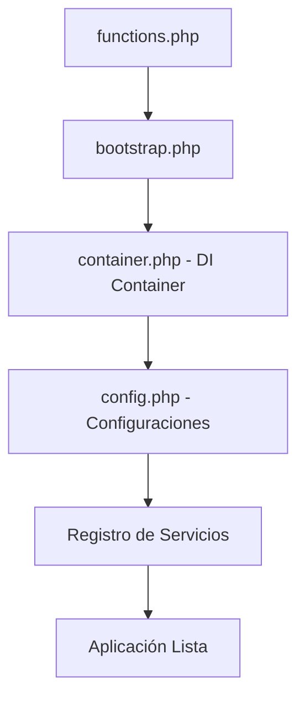

# 🏗️ Documentación de Arquitectura - App Yacht v2.0.0

## 📐 Visión General de la Arquitectura

App Yacht v2.0.0 implementa una **arquitectura limpia** basada en los principios SOLID, con separación clara de responsabilidades y alta mantenibilidad.

### Principios Aplicados

1. **Single Responsibility Principle (SRP)** - Cada clase tiene una sola razón para cambiar
2. **Open/Closed Principle (OCP)** - Abierto para extensión, cerrado para modificación  
3. **Liskov Substitution Principle (LSP)** - Las implementaciones son intercambiables
4. **Interface Segregation Principle (ISP)** - Interfaces específicas y cohesivas
5. **Dependency Inversion Principle (DIP)** - Dependencias hacia abstracciones

### Patrones de Diseño Utilizados

- **Dependency Injection Container** - Gestión centralizada de dependencias
- **Service Layer** - Lógica de negocio encapsulada
- **Repository Pattern** (parcial) - Abstracción de acceso a datos
- **Factory Pattern** - Creación de servicios
- **Adapter Pattern** - Adaptadores de formato
- **Observer Pattern** - Hooks de WordPress

## 🔧 Arquitectura en Capas

```
┌─────────────────────────────────────────────────────────────┐
│                    PRESENTATION LAYER                       │
│  ┌─────────────┐ ┌─────────────┐ ┌─────────────────────────┐ │
│  │ calculator. │ │ template.   │ │ mail.php              │ │
│  │ php (UI)    │ │ php (UI)    │ │ (UI)                    │ │
│  └─────────────┘ └─────────────┘ └─────────────────────────┘ │
└─────────────────────────────────────────────────────────────┘
                                │
                                ▼
┌─────────────────────────────────────────────────────────────┐
│                    APPLICATION LAYER                        │
│  ┌─────────────────────────────────────────────────────────┐ │
│  │                 bootstrap.php                           │ │
│  │         (Orchestration & Dependency Wiring)             │ │
│  └─────────────────────────────────────────────────────────┘ │
└─────────────────────────────────────────────────────────────┘
                                │
                                ▼
┌─────────────────────────────────────────────────────────────┐
│                     DOMAIN LAYER                            │
│  ┌─────────────┐ ┌─────────────┐ ┌─────────────┐ ┌────────┐ │
│  │YachtInfo    │ │CalcService  │ │RenderEngine │ │Mail    │ │
│  │Service      │ │             │ │             │ │Service │ │
│  └─────────────┘ └─────────────┘ └─────────────┘ └────────┘ │
└─────────────────────────────────────────────────────────────┘
                                │
                                ▼
┌─────────────────────────────────────────────────────────────┐
│                 INFRASTRUCTURE LAYER                        │
│  ┌─────────────┐ ┌─────────────┐ ┌─────────────────────────┐ │
│  │Cache        │ │Validator    │ │Config                   │ │
│  │Helper       │ │Helper       │ │                         │ │
│  └─────────────┘ └─────────────┘ └─────────────────────────┘ │
└─────────────────────────────────────────────────────────────┘
```

## 🔄 Flujo de Datos

### 1. Inicialización de la Aplicación



### 2. Flujo de Request (Cálculo)

```mermaid
graph TD
    A[Usuario envía form] --> B[AJAX Handler]
    B --> C[AppYachtBootstrap::handleCalculateCharter]
    C --> D[Container::get('calc_service')]
    D --> E[CalcService::calculateCharter]
    E --> F[ValidatorHelper::validateCalculationData]
    F --> G[Procesamiento de datos]
    G --> H[Respuesta JSON]
```

### 3. Flujo de Template Generation

```mermaid
graph TD
    A[Usuario crea template] --> B[AJAX createTemplate]
    B --> C[AppYachtBootstrap::handleCreateTemplate]
    C --> D[Container::get('render_engine')]
    D --> E[Container::get('yacht_info_service')]
    E --> F[YachtInfoService::extractYachtInfo]
    F --> G[RenderEngine::createTemplate]
    G --> H[Template generado]
```

## 🏭 Contenedor de Inyección de Dependencias

### Funcionalidad

El contenedor DI gestiona la creación y ciclo de vida de los servicios:

```php
class AppYachtContainer {
    private $services = [];      // Factory functions
    private $instances = [];     // Singleton instances
    private $singletons = [];    // Singleton markers
}
```

### Registro de Servicios

```php
// En bootstrap.php
$container->register('yacht_info_service', function() use ($config) {
    return new YachtInfoService($config['scraping']);
}, true); // Singleton

$container->register('calc_service', function() use ($config) {
    return new CalcService($config['calculation']);
});
```

### Resolución de Dependencias

```php
// Lazy loading - solo se crea cuando se necesita
$calcService = $container->get('calc_service');

// Dependencias automáticas
$container->register('mail_service', function($container) use ($config) {
    return new MailService(
        $config['mail'],
        $container->get('render_engine') // Dependencia inyectada
    );
});
```

## 🧩 Módulos y Servicios

### YachtInfoService

**Responsabilidad**: Extracción de información de yates desde URLs externas.

```php
interface YachtInfoServiceInterface {
    public function extractYachtInfo($url);
    public function isValidDomain($url);
    public function getCachedData($url);
    public function setCachedData($url, array $data);
}
```

**Características**:
- Scraping seguro con dominios permitidos
- Sistema de caché avanzado
- Parsers específicos por dominio
- Manejo robusto de errores

### CalcService

**Responsabilidad**: Todos los cálculos relacionados con charter rates.

```php
interface CalcServiceInterface {
    public function calculateCharter(array $data);
    public function calculateMix(array $data);
    public function validateCalculationData(array $data);
    public function applyVAT($amount, array $vatConfig);
}
```

**Características**:
- Cálculos estándar y mixtos
- Manejo de múltiples monedas
- Validación de entrada
- Formateo consistente

### RenderEngine

**Responsabilidad**: Generación unificada de contenido desde templates.

```php
interface RenderEngineInterface {
    public function render($template, array $data, $format = 'html');
    public function loadTemplatePreview(array $data);
    public function createTemplate(array $formData, $yachtData = null);
}
```

**Características**:
- Soporte multi-formato (HTML, texto, email)
- Sistema de variables avanzado
- Caché de templates
- Bloques condicionales y loops

### MailService

**Responsabilidad**: Gestión completa de correo electrónico.

```php
interface MailServiceInterface {
    public function sendEmail(array $data);
    public function sendEmailViaOutlook(array $data, $userId);
    public function isOutlookConnected($userId);
    public function validateEmailData(array $data);
}
```

**Características**:
- Integración Outlook mejorada
- Fallback automático a wp_mail
- Gestión de firmas
- Validación de archivos adjuntos

## 🛠️ Helpers y Utilidades

### CacheHelper

Sistema de caché centralizado y optimizado:

```php
class CacheHelper {
    public static function get($key);
    public static function set($key, $value, $expiration = 3600);
    public static function delete($key);
    public static function flush();
}
```

**Características**:
- Prefijos automáticos
- Generadores de claves
- Limpieza por grupos
- TTL configurables

### ValidatorHelper

Validación robusta y segura:

```php
class ValidatorHelper {
    public static function isValidUrl($url);
    public static function isValidEmail($email);
    public static function validateRequired(array $data, array $required);
    public static function sanitizeInputData(array $data);
}
```

**Características**:
- Validaciones comunes
- Sanitización automática
- Manejo de arrays anidados
- Mensajes de error descriptivos

## 📝 Configuración Centralizada

### Estructura de Configuración

```php
class AppYachtConfig {
    private static $config = [
        'app' => [...],
        'scraping' => [...],
        'calculation' => [...],
        'templates' => [...],
        'mail' => [...],
        'security' => [...],
        'cache' => [...],
        'logging' => [...]
    ];
}
```

### Ventajas

1. **Configuración única** - Un solo lugar para todos los settings
2. **Tipificada** - Estructura predecible
3. **Extensible** - Fácil agregar nuevas configuraciones
4. **Accesible** - API simple para obtener valores
5. **Override** - Posibilidad de sobrescribir valores

## 🔒 Seguridad

### Validación de Entrada

```php
// Toda entrada se valida y sanitiza
$data = ValidatorHelper::sanitizeInputData($_POST);
$errors = ValidatorHelper::validateCalculationData($data);
```

### Dominios Permitidos

```php
// Solo scraping de dominios autorizados
'allowed_domains' => [
    'charterworld.com',
    'yachtcharterfleet.com',
    // ...
]
```

### Rate Limiting

```php
'rate_limit' => [
    'enabled' => true,
    'max_requests' => 100,
    'time_window' => 3600
]
```

### Nonces y Capacidades

```php
// Verificación automática de nonces
wp_verify_nonce($nonce, 'action_name');

// Verificación de capacidades
if (!current_user_can('edit_yacht_templates')) {
    wp_die('Insufficient permissions');
}
```

## 📊 Performance

### Optimizaciones Implementadas

1. **Lazy Loading** - Servicios se cargan solo cuando se necesitan
2. **Singleton Pattern** - Una instancia por request
3. **Caché Inteligente** - Datos costosos se cachean automáticamente
4. **Validación Temprana** - Errores se detectan rápido
5. **Minimal Footprint** - Solo se carga lo necesario

### Métricas Esperadas

- **Inicialización**: +5-10ms
- **Memoria**: +500KB - 1MB
- **Cache Hit Ratio**: >80%
- **Error Rate**: <1%

## 🔧 Extensibilidad

### Agregar Nuevo Servicio

1. **Crear Interface**:
```php
interface MiServicioInterface {
    public function miMetodo();
}
```

2. **Implementar Servicio**:
```php
class MiServicio implements MiServicioInterface {
    public function miMetodo() { /* ... */ }
}
```

3. **Registrar en Container**:
```php
$container->register('mi_servicio', function() {
    return new MiServicio();
});
```

### Agregar Adaptador de Formato

```php
// En RenderEngine
$this->formatAdapters['mi_formato'] = function($content) {
    return $this->procesarMiFormato($content);
};
```

### Extender Configuración

```php
AppYachtConfig::set('mi_modulo', [
    'opcion1' => 'valor1',
    'opcion2' => 'valor2'
]);
```

## 🧪 Testing

### Arquitectura Testeable

La arquitectura facilita el testing:

```php
// Mock de servicios
$mockCalcService = $this->createMock(CalcServiceInterface::class);
$container->register('calc_service', function() use ($mockCalcService) {
    return $mockCalcService;
});

// Test de integración
$result = AppYachtBootstrap::handleCalculateCharter();
```

### Estrategias de Testing

1. **Unit Tests** - Cada servicio individualmente
2. **Integration Tests** - Interacción entre servicios
3. **End-to-End Tests** - Flujo completo de usuario
4. **Performance Tests** - Medición de métricas

## 📈 Monitoring y Debugging

### Logging Estructurado

```php
error_log('AppYacht [' . $service . '] ' . $message);
```

### Debug Mode

```php
if (AppYachtConfig::get('app.debug')) {
    // Información adicional
    echo '<!-- Debug info -->';
}
```

### Health Checks

```php
function app_yacht_health_check() {
    $health = [
        'services' => count($container->getRegisteredServices()),
        'cache' => CacheHelper::get('health_check') !== false,
        'config' => !is_null(AppYachtConfig::get('app'))
    ];
    
    return $health;
}
```

## 🚀 Futuras Mejoras

### Roadmap Técnico

1. **v2.1**: 
   - API REST completa
   - Tests automatizados
   - CI/CD pipeline

2. **v2.2**:
   - Multi-tenancy
   - Plugin independiente
   - Dashboard avanzado

3. **v3.0**:
   - Microservicios
   - Event Sourcing
   - Real-time updates

### Consideraciones de Escalabilidad

- **Database Abstraction Layer**
- **Queue System** para operaciones pesadas  
- **API Rate Limiting** más sofisticado
- **Caching Layer** distribuido
- **Monitoring & Alerting** avanzado

---

**Esta arquitectura proporciona una base sólida, mantenible y escalable para el futuro crecimiento de App Yacht.**
